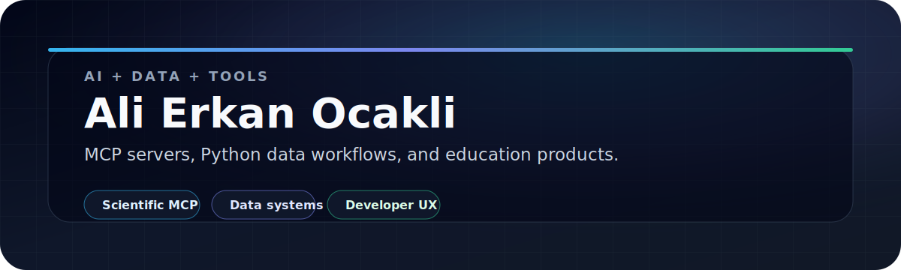

  

  
  
  

I build practical **AI, data, and developer tools**: MCP servers for scientific
workflows, Python data projects, and focused education products with clear setup,
CI, and documentation.

## Focus

- **AI tooling:** MCP servers and local-first assistants for scientific and developer workflows.
- **Data systems:** Python notebooks, reproducible analysis, and database-backed pipelines.
- **Education products:** TypeScript/Next.js apps that turn learning workflows into usable tools.
- **Repository quality:** small public projects with real READMEs, validation steps, and maintenance automation.

## Featured Work

1. **[gromacs-mcp](https://github.com/Alierkn/gromacs-mcp)** - MCP server for local GROMACS molecular dynamics setup, runs, and analysis. `Python` `MCP` `GROMACS`
2. **[vmd-mcp](https://github.com/Alierkn/vmd-mcp)** - Headless VMD MCP server for molecular structure analysis and display-free rendering. `Python` `MCP` `VMD`
3. **[boost](https://github.com/Alierkn/boost)** - macOS RAM, CPU, process, and disk tune-up CLI with a live TUI dashboard. `Bash` `gum` `macOS`
4. **[claude-tracker](https://github.com/Alierkn/claude-tracker)** - Local-first Chrome extension for Claude.ai usage windows and reset times. `JavaScript` `Chrome MV3`
5. **[Data-Mining-Lesson-Unime](https://github.com/Alierkn/Data-Mining-Lesson-Unime)** - University data mining notebooks, datasets, and practical exercises. `Python` `Jupyter`
6. **[edufrench](https://github.com/Alierkn/edufrench)** - French-curriculum learning platform for international students. `TypeScript` `Next.js`

## Stack

**Languages**

**Product and data**

## Activity

  

  
Contribution snake

   
  <picture>
    <source media="(prefers-color-scheme: dark)" srcset="https://raw.githubusercontent.com/Alierkn/Alierkn/output/github-snake-dark.svg" />
    <source media="(prefers-color-scheme: light)" srcset="https://raw.githubusercontent.com/Alierkn/Alierkn/output/github-snake.svg" />
    
  </picture>

## Contact

For public project questions, please open an issue in the relevant repository.
For EducationalTR, use [educationaltr.com](https://www.educationaltr.com).
